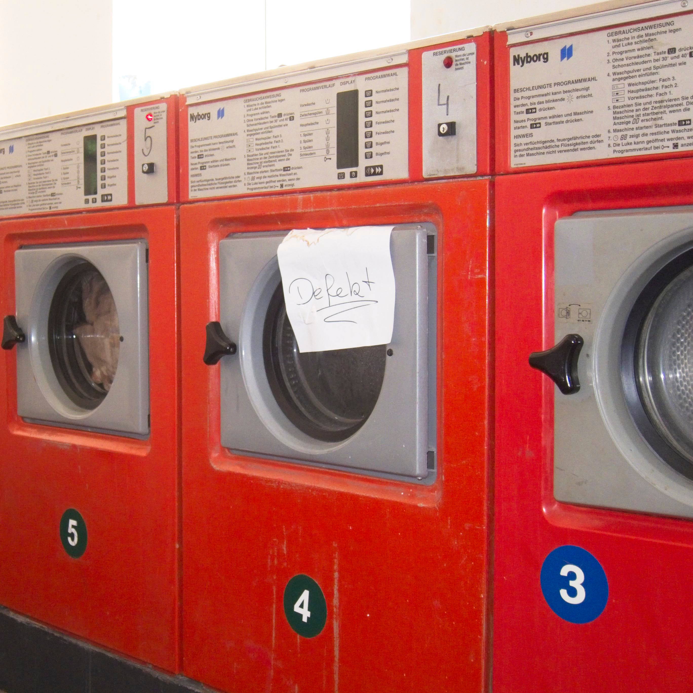

At the moment I find it difficult to engage with social media. I get overloaded with information and struggle to filter out the good things from the bits I don’t want to see. I’ve started this blog so that I can post things without having to use these platforms.

This year I am spending a lot of my time learning how to code. The things I am working on are interactive and often need explaining before they can be used. For this reason I think a blog is a better platform to present them as I have more control over the format of each post. I don’t know exactly what I will be sharing or what format it will take so I think my best bet is to start posting and see what happens.

Gabriel
