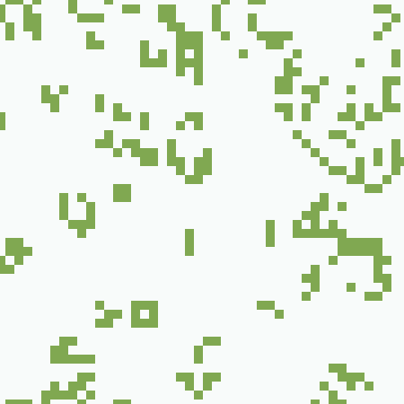
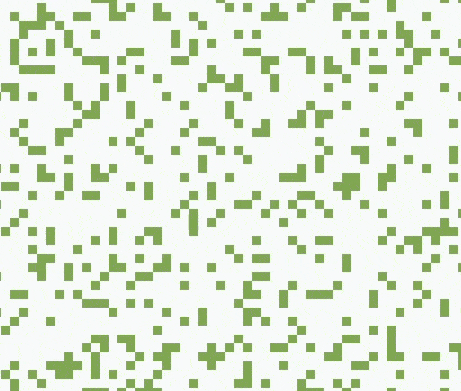

[Conway's Game of Life](https://en.wikipedia.org/wiki/Conway%27s_Game_of_Life) is a cellular automata first devised by the mathematician John Conway in 1970. The game consists of a grid of cells that have two states, either dead or alive. Each round the state of a cell is decided by the following three rules.

- Any living cell with two or three living neighbours stays alive.
- Any dead cell with three live neighbours comes to life.
- Any live cell with less than 2 living neighbours or more than three living neighbours dies.

These simple rules lead to some interesting generative patterns and behaviour.

Using Robert Heaton's guide from his series of blog posts ['Programming Projects for Advanced Beginners'](https://robertheaton.com/2018/12/08/programming-projects-for-advanced-beginners/) I built my own implementation that runs in the browser. You can try it out [here](https://gabrieldavison.github.io/conways-game-of-life/).

Not wanting to stop there I added a musical element to my design and a new iteration called the Sound of Life was born. This version uses the game of life as a generative musical sequencer. The board is divided up into zones. Each step the sequencer counts the number of living cells in the active zone and uses this information to trigger a note from a predefined scale.

The sound generation is handled by the [Tone.js library](https://tonejs.github.io/). I used it to build a 2-op FM synthesizer that runs into a delay with a feedback control. The result sounds surprisingly good.

You can try it yourself [here](https://gabrieldavison.github.io/sound-of-life/). Or read through some more detailed documentation on the projects [github page](https://github.com/gabrieldavison/sound-of-life).
