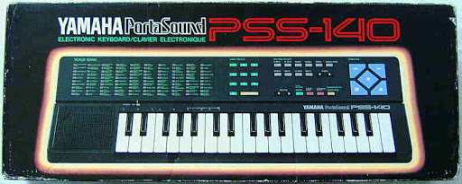

Earlier this year I was lucky enough to be accepted into the Fall 1 batch at the [Recurse Center](https://www.recurse.com/) which lasted for 12 weeks. In their own words "The Recurse Center is a self-directed, community-driven educational retreat for programmers". The website explains their educational philosophy in more detail and I highly recommend anyone who is interested to research further and think about applying.

During my time at the RC I chose to work on building browser based musical instruments. At the end of the 12 weeks I had 2 finished projects and several more that I didn't finish that I'll be exploring further in the coming weeks.

This first is called [Engine](https://github.com/gabrieldavison/engine) and it's an FM synthesizer based on the architecture of the [Yamaha Portasound](https://en.wikipedia.org/wiki/Yamaha_Portasound) series of keyboards. I grew up with these and have always kept them around as they are surprisingly enjoyable toys that I have actually made a lot of music with. They have a unique and very digital sound due to the two-op FM synthesis architecture of the YM2413 chip they use to generate sound.

At the moment Engine can be played with a computer keyboard but I plan to add midi input support at some point in the future.

My second project is an instrument called [SpacetimeJS](https://github.com/gabrieldavison/spacetimeJS) that builds on Engine. A sequencer cycles through a series of commands that can be changed using the arrow keys. These commands change the value of the current note or change the active step in some way. You can read a full description of how it works on the projects [github page](https://github.com/gabrieldavison/spacetimeJS).

The idea came from a [programming exercise](https://monome.org/docs/norns/study-3/) for the [monome norns](https://monome.org/docs/norns/) which is a programmable music computer. The original project was written in lua but because of how similar the syntax is to javascript I was able to easily port the logic over into a web app. I have expanded on the initial idea by adding presets, extra commands and a GUI that renders to an html canvas. I feel like this makes it a much more complete instrument. All of the sounds are generated by a built in instance of Engine. Just like with Engine I'm planning on adding midi support in the near future.

I had a great time at the RC and got to meet some interesting people. I started work on several other projects that I'll be sharing soon. If you'd like to see some of my previous work then check out my projects page.
